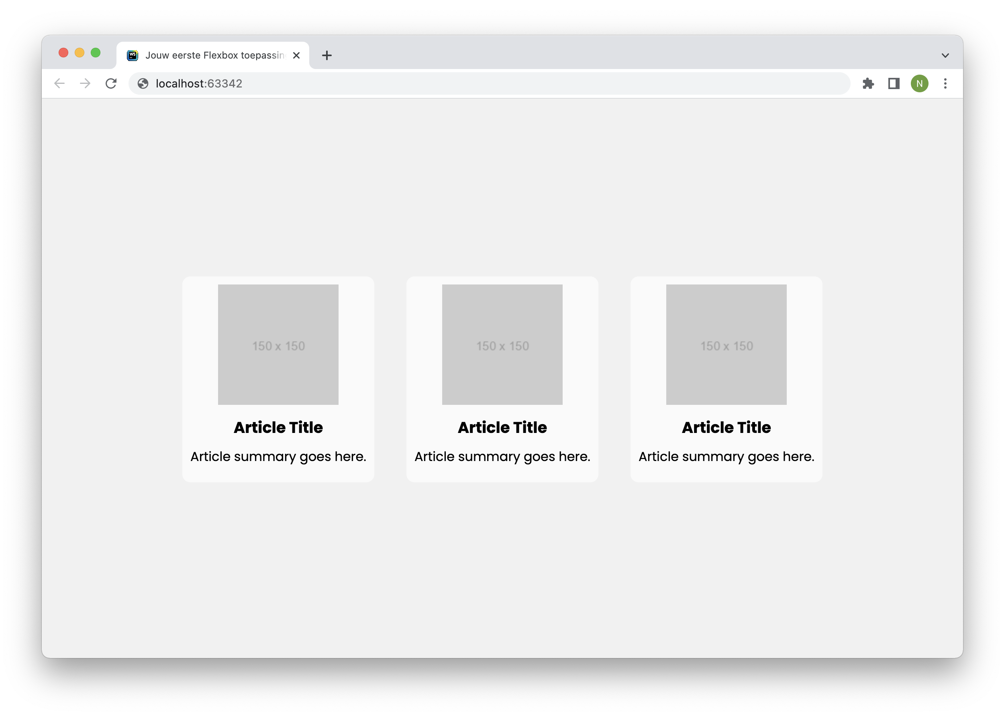
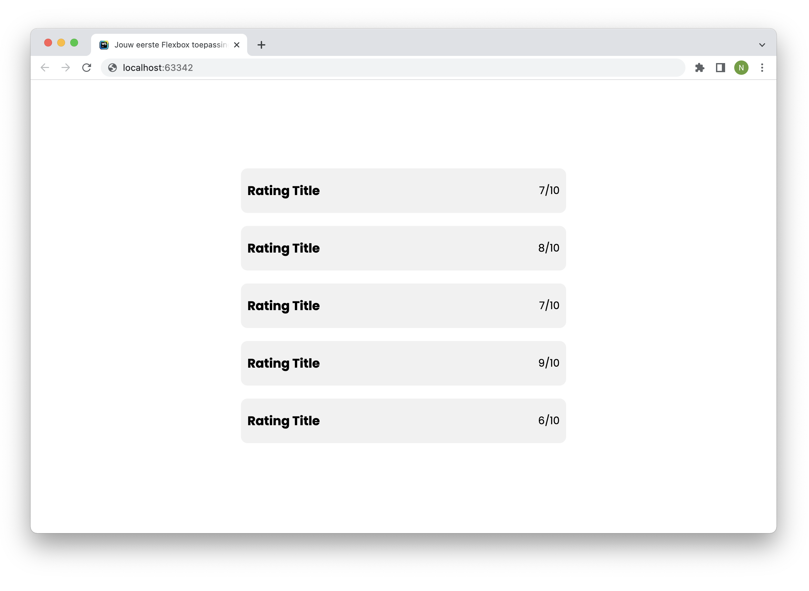

# Opdrachtbeschrijving

Zoals je zojuist hebt gezien, heb je met flexbox veel controle over de posities van elementen. Om deze kennis direct in de praktijk te brengen, ga je elementen op de juiste manier uitlijnen.

De HTML elementen (de containers én items) die je moet uitlijnen, zijn al voor je klaargezet in `index.html`. Je hoeft in deze opdrachten dus alleen de CSS te schrijven. Door de containers en de items de juiste properties te geven, zorg jij ervoor dat de HTML er zo uit komt te zien als het voorbeeld. Je hoeft hiervoor alleen de flexbox-properties te gebruiken die je voorbij hebt zien komen in EdHub. Je mag de styling in `do-not-edit.css` niet aanpassen.

Je kunt deze opdracht maken door het project te clonen of downloaden naar jouw eigen computer via deze GitHub repository. De uitwerkingen staan op de branch _uitwerkingen_.

## Opdracht 1

Open het HTML-document en bekijk de elementen. Zorg ervoor dat de items in `container-1` er net zo uit komen te zien als het voorbeeld, zonder aanpassingen te maken in de HTML. Je hoeft hier enkel en alleen Flexbox-properties voor te gebruiken. _Tip:_ de container is al voorzien van een vaste hoogte, dus hier hoef je geen rekening mee te houden.

## Opdracht 2

Zorg ervoor dat de items in `container-2` er net zo uit komen te zien als het voorbeeld, zonder aanpassingen te maken in de HTML. Deze keer mag je _wel_ classes toevoegen als je dit nodig vindt. Om de elementen op de juiste plekken te krijgen, hoef je enkel en alleen Flexbox-properties te gebruiken. Om tot het eindresultaat te komen, werk je in twee stapjes:
1. Zorg eerst dat de `
`-jes op de juiste plek in de `<section>` komen te staan;
2. Kijk daarna hoe je de tekst in de `
`-jes kunt positioneren. Dit doe je door de `
`-jes opzichzelf _ook weer te beschouwen als een Flexbox container_!